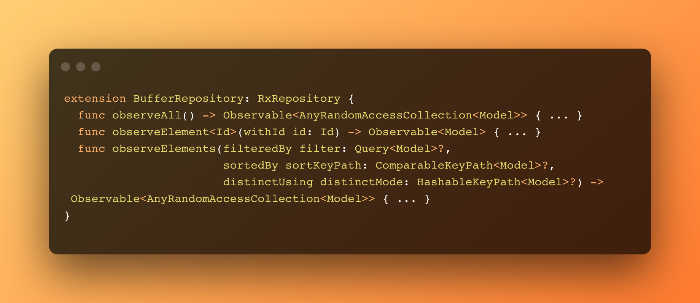
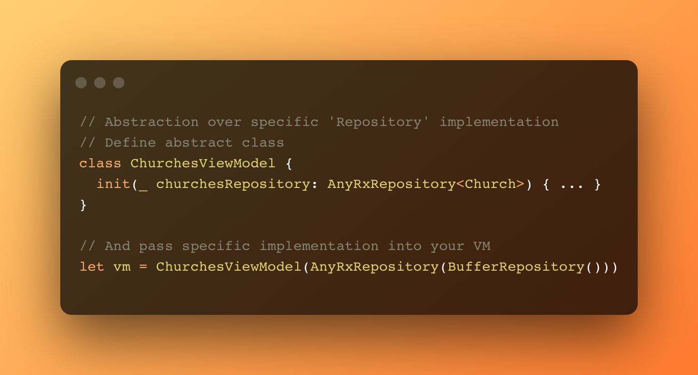
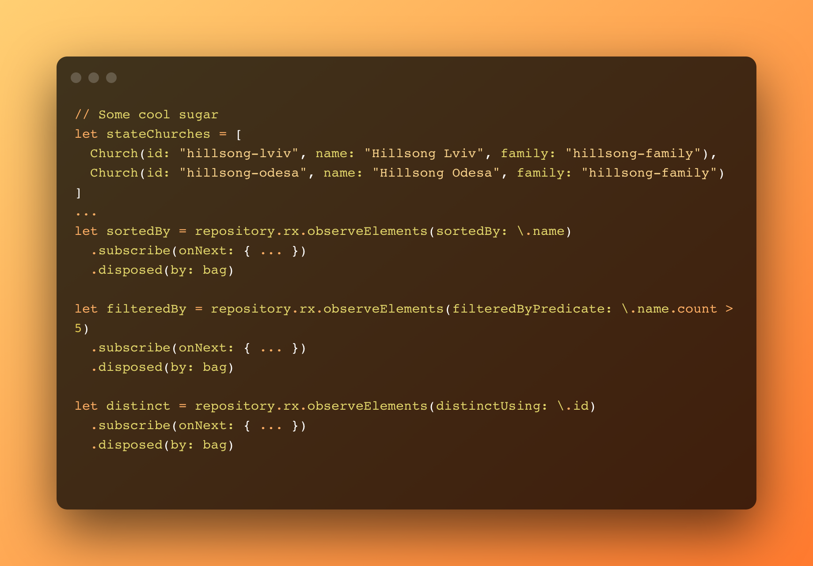

 

 

🍊 + 🍬

**RxXRepository** is reactive extension for [XRepository](https://github.com/sashkopotapov/XRepository). This extension allows implementations of Repository pattern become rx-compatable and adds observing methods to CRUD operations.

##  Getting started
To make your Repository reactive, simply conform it to `RxRepository`  protocol and implement three following methods, because all CRUD methods has default implementatons accesible throug `repository.rx.getAll()` signature.

  

And you have to change `AnyRepository` to `AnyRxRepository`. Thats all. Your repository is rx-compatible.

## Usage
Usage is simple, as we are using abstract `AnyRxRepository`:

  

You have default implementation or all your CRUD operations and all the great sugar from `Repository` also comes to observing methods:

  

## 👤 Author
This framework is created by Sashko Potapov.

## 📃 License

XCoordinator is released under an MIT license. See [License.md](https://github.com/sashkopotapov/XRepository/blob/main/LICENSE) for more information.
